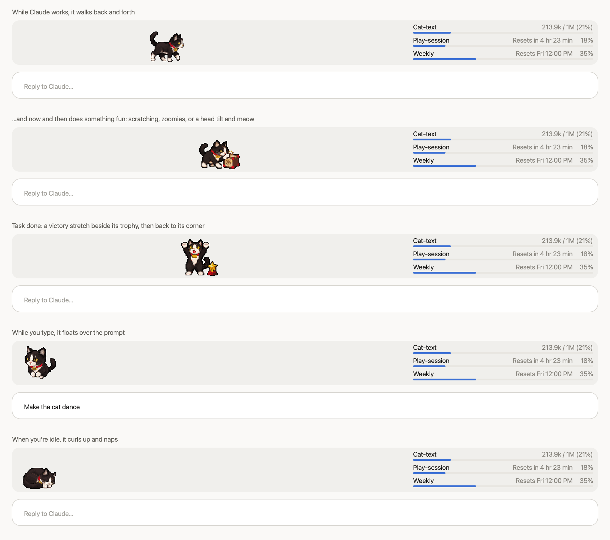

# My-the-cat 🐈‍⬛

By ehJimmy. Unofficial community mod, not made by Anthropic.

A pixel-art tuxedo cat with a red "MY" collar that lives just above your prompt in the **Claude desktop app** (Code tab).

- **While Claude works**, it walks back and forth and now and then does something fun at a random spot: scratches its scratching block, does zoomies after its ball, or tilts its head and meows at its toy mouse.
- **When a task is done**, it does a victory stretch beside its star trophy, walks back to its corner and sits.
- **While you type**, it floats over the prompt with its paws tucked. A sleeping cat stretches awake first.
- **When you're idle**, it curls up and naps.
- **On the right**, it shows your usage: **Cat-text** (context window), **Play-session** (5-hour limit) and **Weekly**.

## Install

My-the-cat is made for the Claude desktop app. Mods like this one are an early-access feature, so keep the app up to date.

It was also built to run in the terminal (CLI), but that version is completely untested, so try it at your own risk. If the cat doesn't show up, it's probably just napping somewhere you can't see. Cats do that.

1. **Ask Claude to install it.** In the Claude desktop app, open the **Code** tab, start a new chat and send:

   > Please install the Claude Code plugin my-the-cat: add the plugin marketplace ehJimmy/my-the-cat, then install my-the-cat@my-the-cat.

2. **Start a new chat** in the Code tab and send a message. The cat appears above the prompt. Chats that were already open need the app restarted (quit and reopen it).

## Updates

When there's a new version, ask Claude in a Code chat:

> Please update the Claude Code plugin my-the-cat@my-the-cat.

## Uninstall

Ask Claude in a Code chat:

> Please uninstall the Claude Code plugin my-the-cat@my-the-cat.

## Good to know

- **Private by design:** the cat runs only on your own computer and sends nothing anywhere. The usage panel reads your usage inside your own Claude app and only shows it to you.
- The usage limits show only on a Claude subscription. With an API key you'll see just Cat-text.

## License

MIT, see [LICENSE](LICENSE). You're welcome to use, change and share the cat; just keep the credit to ehJimmy.
